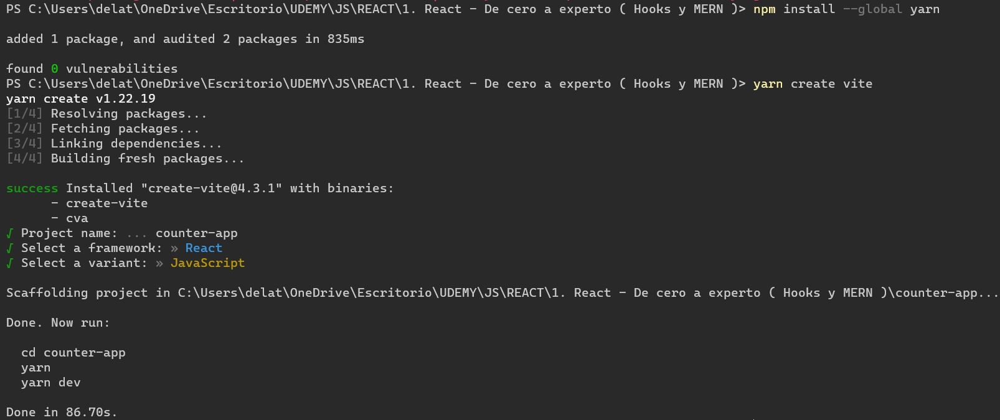
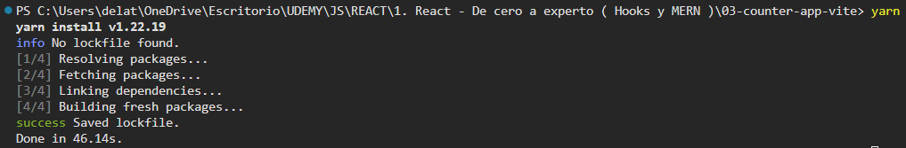
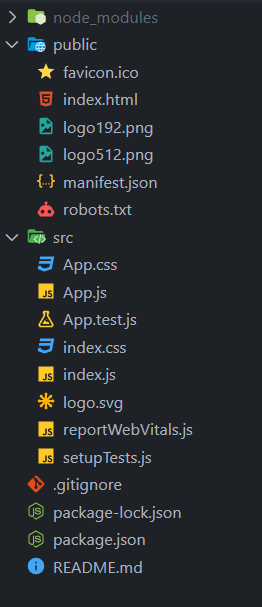
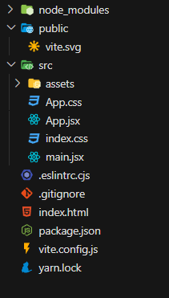
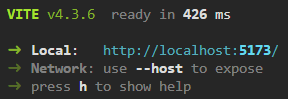

# <font color="red">Sección 1: Introducción</font>
## <font color="yellow">1. Introducción al curso</font>

## <font color="yellow">2. ¿Cómo funcionará el curso?</font>

## <font color="yellow">3. ¿Cómo hacer preguntas?</font>

## <font color="yellow">4. Instalaciones necesarias y recomendadas</font>
### **Instalaciones Necesarias**
- [Google Chrome](https://www.google.com/chrome/)
- [React Developer Tools](https://chrome.google.com/webstore/detail/react-developer-tools/fmkadmapgofadopljbjfkapdkoienihi?hl=es&authuser=1)
- [Redux Devtools](https://chrome.google.com/webstore/detail/redux-devtools/lmhkpmbekcpmknklioeibfkpmmfibljd?hl=es)
- [Visual Studio Code](https://code.visualstudio.com/)
- [Postman](https://www.postman.com/downloads/)
- [Mongo Compass](https://www.mongodb.com/try/download/compass)
- [Git](https://git-scm.com/)
- [Node](https://nodejs.org/es/)
### **Extensiones de VSCode**
- [Activitus Bar](https://marketplace.visualstudio.com/items?itemName=Gruntfuggly.activitusbar)
- **Configuración del Bracket Pair Colorizer 2**
    [Bracket Pair Colorizer 2](https://marketplace.visualstudio.com/items?itemName=CoenraadS.bracket-pair-colorizer-2)
    ```
    "bracket-pair-colorizer-2.colors": [
        "#fafafa",
        "#9F51B6",
        "#F7C244",
        "#F07850",
        "#9CDD29",
        "#C497D4"
    ],
    ```
- **Tema en VSCode:**
    - [Monokai Night](https://marketplace.visualstudio.com/items?itemName=fabiospampinato.vscode-monokai-night)
    - [Iconos](https://marketplace.visualstudio.com/items?itemName=PKief.material-icon-theme)
- **Instalaciones recomendadas sobre React**
    - [ES7 React/Redux](https://marketplace.visualstudio.com/items?itemName=dsznajder.es7-react-js-snippets)
    - [Simple React Snippets](https://marketplace.visualstudio.com/items?itemName=burkeholland.simple-react-snippets)
    - [Auto Close Tag](https://marketplace.visualstudio.com/items?itemName=formulahendry.auto-close-tag)

## <font color="yellow">5. ¡Únete a Nuestra Comunidad de DevTalles en Discord!</font>

# <font color="red">Sección 2: Introducción a React y conceptos generales</font>
## <font color="yellow">6. Introducción a la sección</font>

## <font color="yellow">7. Temas puntuales de la sección</font>

**¿Qué aprenderemos en esta sección?**

- ¿Qué es React?
- Conceptos generales
- Babel
- JSX

Daremos nuestros primeros pasos y una pequeña aplicación que nos ayudará a perderle el miedo a React rápidamente

## <font color="yellow">8. ¿Qué es React?</font>

Librería JS para crear aplicaciones.

Declarativa.

Eficiente.

Predecible (todo fluye en una sola vía).

Componentes: piezas de código encapsuladas que pueden tener estado (permite dividir una aplicación muy grande).

Server-side con Node.

Aplicaciones móviles con React Native.

```jsx
// Aplicacion en React mas sencilla posible
// JSX = JS + XML

const divRoot = document.querySelector('#root'); // se hace referencia a un div con id="root"
ReactDOM.render( <h1>Hola Mundo</h1> , divRoot ); // inyecta un html dentro de la etiqueta referenciada

//cont h1Tag = <h1>Hola Mundo</h1>; // variable/contante que contiene la etiqueta
//ReactDOM.render( h1Tag, divRoot ); // llama a una funcion de React para mostrar la "algo" en el html

//const h1Tag = document.createElement('h1', null, `Hola, soy ${ nombre }`);
    // version similar al hola mundo escrito en JSX (en React se simplifica usando simples etiquetas)
```

## <font color="yellow">9. Primeros pasos en React</font>

Primera aplicación completa con React:

```html
<!DOCTYPE html>
<html lang="en">
<head>
    <meta charset="UTF-8">

    <!-- Cargat React -->
    <script crossorigin src="<https://unpkg.com/react@16/umd/react.production.min.js>"></script>
    <script crossorigin src="<https://unpkg.com/react-dom@16/umd/react-dom.production.min.js>"></script>
    <!-- Importacion de babel (permite convertir javascript moderno a javascript comprensible por el navegador) -->
    <script src="<https://unpkg.com/babel-standalone@6/babel.min.js>"></script>

    <meta http-equiv="X-UA-Compatible" content="IE=edge">
    <title>ReactApp</title>
</head>
<body>

    <div id="root"></div>

    <script type="text/babel">

        const divRoot = document.querySelector('#root');

        const nombre = 'Alberto';
        const h1Tag = <h1>Hola Mundo, soy { nombre }!</h1>;

        ReactDOM.render( h1Tag, divRoot );

    </script>
    
</body>
</html>
```

## <font color="yellow">10. Introducción a Babel</font>

Babel: permite usar las últimas innovaciones del ECMAScript en cualquier navegador aunque este no soporte aun estas mejoras (incompatibilidad).

- [https://babeljs.io/](https://babeljs.io/)


# <font color="red">Sección 3: Introducción a JavaScript moderno</font>

## <font color="yellow">11. Introducción a la sección</font>

Tema fundamental: desestructuración

## <font color="yellow">12. Temas puntuales de la sección</font>

### **¿Temas de la sección?**

- Generar la base sobre JavaScript
- Constantes y variables Let
- Template String
- Objetos literales
- Arreglos
- Desestructruación * (sumamente importante)
- Promesas
- Fetch API
- Ternarios
- Async - Await

El objetivo es tener las bases que permitan diferenciar fácilmente qué es propio de React y qué es propio de JavaScript.

Estos conceptos y ejercicios ayudarán a suavizar la curva de aprendizaje de React.

## <font color="yellow">13. Nota Importante Create React App - CRA</font>

Al intentar crear un proyecto con CRA actualmente existe un error por incompatibilidad entre dependencias. Esta ya no es una forma recomendada de crear aplicaciones de React por lo cual se recomienda hacer uso de Vite.

Es posible crear el proyecto usando el template de vanilla JavaScript, React no se usará hasta la siguiente sección.

## <font color="yellow">14. Inicio de proyecto - Bases de JavaScript</font>

<mark class="orange">Al intentar crear un proyecto con CRA actualmente se encuentra un error por incompatibilidad entre dependencias. Esta ya no es una forma recomendada de crear aplicaciones de React por lo cual se recomienda [**hacer uso de Vite**](https://vite.dev/guide/).</mark>

<mark class="orange">Es posible crear el proyecto usando el template de vanilla JavaScript, pues no se usará React hasta la próxima sección.</mark>

1. Comprobar versión de npx (en caso de que no se reconozca el comando instalar node):
    - npx --version
2. Posicionarse sobre la carpeta general del proyecto:
    - cd "C:\Users\delat\Desktop\UDEMY\JS\REACT\1. React - De cero a experto ( Hooks y MERN )”
3. Crear la nueva aplicación (02-intro-javascript):
    - npx create-react-app 02-intro-javascript
    - [https://create-react-app.dev/](https://create-react-app.dev/)
4. Abrir la nueva carpeta en Visual Studio Code
5. Desplazarse hasta la nueva carpeta del proyecto:
    - cd 02-intro-javascript
6. Ejecutar el comando que inicializa el proyecto:
    - npm start
    - También → yarn start
7. React buscará el archivo index.js e iniciará la aplicación desde ahí
8. En las nuevas versiones de React la página no se recarga automáticamente cada vez que se salva:
    - [https://github.com/facebook/create-react-app/issues/9904#issuecomment-735223010](https://github.com/facebook/create-react-app/issues/9904#issuecomment-735223010)
    - Es necesario crear un archivo .env sobre la raiz del proyecto y escribir en él: FAST_REFRESH=false
    - Ejecutar de nuevo en la consola sobre la carpeta del proyecto: npm start

## <font color="yellow">15. Variables y constantes</font>

No se debe usar var, únicamente let y const

Tanto let como const únicamente funcionan dentro de su scope

```jsx
// Variables y constantes
    // No usar var, unicamente const y let
    const nombre = 'Alberto';
    const apellido = 'De La Torre';

    let valorDado = 5;
    valorDado = 4;

    console.log( nombre, apellido, valorDado );

    if ( true ) {
        let valorDado = 6; // no es el mismo valorDado que existe fuera (diferente scope)

        console.log( valorDado );
    }

    console.log( valorDado );
```

## <font color="yellow">16. Template String</font>

Uso de Backtick / Back Quote → : permiten añadir código javascript mediante ${ }

```jsx
const nombre   = 'Alberto';
const apellido = 'De La Torre';

// const nombreCompleto = nombre + ' ' + apellido;
const nombreCompleto = ` Hola Mundo `; // Backtick / Back Quote pueden servir para escribir texto normal. equivalente a " " o ' '
const nombreCompleto2 = `${nombre} ${apellido}`; // es necesario crear una nueva constante ya que a estas no se les puede cambiar el valor
const nombreCompleto3 = `
        ${nombre}
        ${apellido}
    `; // los backtick permiten y recogen (escriben), todos los saltos de linea que se produzcan
const nombreCompleto4 = `${1 + 1}`; // el codigo realiza cualquier operacion que se establezca dentro de las llaves ya que eso es codigo javascript

console.log( nombreCompleto4 );

function getSaludo( nombre ) {
    return `Hola ${nombre}`;
}

console.log( `Este es un texto: ${ getSaludo( nombreCompleto2 ) }`);
```

## <font color="yellow">17. Objetos lilterales</font>

Copia de un objeto anterior sobre un nuevo objeto al que se le pasa el objeto anterior sobre un campo homonimo al nombre del objeto anterior:

- { nombreObjetoAnterior }

Clonación de un objeto → Operador Spread:

- { ...nombreObjetoAnterior }

```jsx
const persona = {
    nombre: 'Tony',
    apellido: 'Stark',
    edad: 45,
    direccion: {
        ciudad: 'New York',
        zip: 553221321,
        lat: 14.43738,
        lng: 34.73924,
    }, // la coma final es una buena pactica en javascript
};

console.log( persona ); // se obtiene el objeto completo
console.log( persona.nombre ); // se obtiene un campo del objeto
console.log( { persona } ); // es equivalente a { persona: persona } -> un nuevo objeto al que se le pasa el objeto anterior sobre un campo homonimo al nombre del objeto anterior
console.table( persona ); // muestra el resultado como una tabla

const persona2 = persona; // copia la referencia en memoria de un objeto al otro (siguen siendo el mismo objeto)
persona2.nombre = 'Peter'; // cambia el nombre tanto en persona como en persona2

const persona3 = { ...persona }; // de este modo si que se estaria clonando el objeto
persona3.nombre = 'John'; // unicamente cambia el nombre en persona3

console.log( persona );
console.log( persona2 );
console.log( persona3 );
```

## <font color="yellow">18. Arreglos</font>

Ejecutar funciones sobre todos los elementos de un array → **Array.prototype.map():** [https://developer.mozilla.org/es/docs/Web/JavaScript/Reference/Global_Objects/Array/map](https://developer.mozilla.org/es/docs/Web/JavaScript/Reference/Global_Objects/Array/map)

```jsx
// Arreglos en JS

// const arreglo = new Array(); // forma no recomendada a menos que se quiera crear un arreglo con un numero inicial de posiciones
                                // new Array( 100 ); -> incluso asi el arreglo seguiria siendo ampiable -> arreglo.push(1)

const arreglo = [];             // equivalente a -> const arreglo = [1,2,3,4];
arreglo.push(1);                // no recomendable usar push ya que modifica el objeto principal (usar spread)
arreglo.push(2);
arreglo.push(3);
arreglo.push(4);

// let arreglo2 = arreglo;      // copia la direccion en memoria
// arreglo.push(5);

let arreglo2 = [ ...arreglo, 5 ]; // forma correcta de copiar los valores de un arreglo a otro y adicionar nuevos valores -> operador Spread

console.log( arreglo );
console.log( arreglo2 );

const arreglo3 = arreglo2.map( function ( valorPosicion ) { // la funcion del prototype map fuerza la creacion de un nuevo arreglo
    return valorPosicion * 2;
});

console.log( arreglo3 );
```

## <font color="yellow">19. Funciones</font>

```jsx
// Funciones en JS
function saludar( nombre ) { // No crear funciones de esta manera, pueden ser sustituidas por un valor a posteriori
    return `Hola, ${ nombre }`;
}

saludar = 30

console.log( saludar );

const saludar2 = function( nombre ) { // Usar siempre este metodo para crear funciones -> impide reescritura
    return `Hola, ${ nombre }`;
}

console.log( saludar2( 'Mundo' ) );

// Convertir una funcion normal a una funcion lambda (una funcion flecha)
const saludar3 = ( nombre ) => {
    return `Hola, ${ nombre }`;
}

console.log( saludar3( 'Mundo' ) );

// Cuando solo hay un return dentro de la funcion lambda esta se puede simplificar
const saludar4 = ( nombre ) => `Hola, ${ nombre }`;

console.log( saludar4( 'Mundo' ) );

// Cuando la funcion no tiene argumentos
const saludar5 = () => `Hola, Mundo`;

console.log( saludar5() );

// En el caso de que una lambda devuelva un objeto
const saludar6 = () => {
    return {
        uid: 'nombreUsuario',
        password: 'claveUsuario'
    }
};

console.log( saludar6() );

// En el caso de que una lambda devuelva un objeto ->
    // para simplificar la funcion es necesario poner parentesis para que se distinga la diferencia entre el cuerpo de la funcion y el objeto
const saludar7 = () => ({
    uid: 'nombreUsuario',
    password: 'claveUsuario'
});

console.log( saludar7() );
```

## <font color="yellow">20. Desestructuación de Objetos</font>

Documentación desestructuración: [](https://developer.mozilla.org/es/docs/Web/JavaScript/Reference/Operators/Destructuring_assignment)[https://developer.mozilla.org/es/docs/Web/JavaScript/Reference/Operators/Destructuring_assignmen](https://developer.mozilla.org/es/docs/Web/JavaScript/Reference/Operators/Destructuring_assignmen)

```jsx
// Desestructuracion
// Asignacion desestructurante

const persona = {
    nombre: 'Tony',
    edad: 45,
    clave: 'Ironman'
};

// extraction antigua
console.log( persona.nombre );
console.log( persona.edad );
console.log( persona.clave );

// extraction desestructurada con el mismo nombre del campo
const { nombre } = persona;

console.log( nombre );

// extraction desestructurada con un nombre diferente al del campo
const { nombre:variableNombre } = persona;

console.log( variableNombre );

// extraction desestructurada de multiples campos (es independiente del orden)
const { edad, clave } = persona;

console.log( edad );
console.log( clave );

// extraction desestructurada dentro de la funcion
const retornaPersona = ( usuario ) => {
    console.log( usuario );

    const { edad, nombre, clave } = usuario;

    console.log( nombre, clave, edad );
};

retornaPersona( persona );

// extraction desestructurada en los propios argumentos de la funcion
const retornaPersona2 = ( { edad, nombre, clave } ) => {
    console.log( nombre, clave, edad );
};

retornaPersona2( persona );

// extraction desestructurada añadiendo argumentos adicionales no definidos previamente
const retornaPersona3 = ( { edad, nombre, rango = 'Capitan' } ) => {
    console.log( nombre, rango, edad );
};

retornaPersona3( persona );

// extraction desestructurada otorgando valores por defecto a campos en lugar de que estos no lleguen definidos
// (en caso de que si esten previamente definidos no pierden su valor)
const retornaPersona4 = ( { edad, nombre, clave = 'Capitan' } ) => {
    console.log( nombre, clave, edad );
};

retornaPersona4( persona );

// extraction desestructurada de los datos devueltos por una funcion
const useContext = ( { edad, nombre, clave } ) => {
    return {
        nombreClave: clave,
        anios: edad,
        latlng: {
            lat: 13.235,
            lng: 87.429
        }
    }
};

const { nombreClave, anios, latlng:{ lat, lng } } = useContext( persona );

console.log( nombreClave, anios, lat, lng );
```

## <font color="yellow">21. Desestructuación de Arreglos</font>

```jsx
const personajes = ['Goku','Vegeta','Trunks'];

console.log( personajes );
console.log( personajes[0] );
console.log( personajes[1] );
console.log( personajes[2] );

const [ p1 ] = personajes;
const [ , p2 ] = personajes;
const [ , , p3 ] = personajes;
const [ personaje1, personaje2, personaje3 ] = personajes;

console.log( p1 );
console.log( p2 );
console.log( p3 );
console.log( personaje1 + ' ' + personaje2 + ' ' + personaje3 );

const retornaArreglo = () => {
    return ['ABC', 123];
}

const [ letras, numeros ] = retornaArreglo();

console.log( letras, numeros );

const useState = ( valor ) => {
    return [ valor, () => { console.log( 'Hola Mundo' ) } ];
}

const arr = useState( 'Goku' );

arr[1](); // Sintaxis recuperacion de una funcion de un arreglo y llamada a la misma a traves de los parentesis

const [ nombre, setNombre ] = useState( 'Goku' );

console.log( nombre );
setNombre(); // Sintaxis llamada a la funcion desestructurada
```

## <font color="yellow">22. Import, export y funciones comunes de arreglos</font>

```jsx
/** data/heroes.js **/

export const heroes = [ // Es necesario exprotar el archivo para poder importarlo
    {
        id: 1,
        name: 'Batman',
        owner: 'DC'
    },
    {
        id: 2,
        name: 'Spiderman',
        owner: 'Marvel'
    },
    {
        id: 3,
        name: 'Superman',
        owner: 'DC'
    },
    {
        id: 4,
        name: 'Flash',
        owner: 'DC'
    },
    {
        id: 5,
        name: 'Wolverine',
        owner: 'Marvel'
    },
];
```

```jsx
/** index.js **/

// import { heroes } from './data/heroes'; // En la ruta tambien se puede poner la extension del archivo pero eso normalmente nadie lo hace
import { heroes } from './data/heroes' // imp + tab permite escribir automaticamente los imports

console.log( heroes );

const getHeroesByIdVerbosa = ( id ) => {
    return heroes.find( ( heroe ) => {
        if ( heroe.id === id ) {
            return true;
        } else {
            return false;
        }
    } );
}

const getHeroesById = ( id ) => {
    return heroes.find( ( element ) => element.id === id );
}

const getHeroesByIdSimple = ( id ) => heroes.find( element => element.id === id ); // obtencion elemento unico

console.log( getHeroesByIdVerbosa( 4 ) );
console.log( getHeroesById( 2 ) );
console.log( getHeroesByIdSimple( 5 ) );

const getHeroesByOwner = ( owner ) => heroes.filter( element => element.owner === owner ); // obtencion multiples elementos

console.log( getHeroesByOwner( 'DC' ) );
console.log( getHeroesByOwner( 'Marvel' ) );
```

## <font color="yellow">23. Múltiples exportaciones y exportaciones por defecto</font>

Tres modos de exportación por defecto:

- export default [...];
- const nombreElemento = [...]; export default nombreElemento;
- const nombreElemento = [...]; export { nombreElemento as default };

```jsx
/** data/heroes.js **/

// export default [ // Formato de la exportacion por defecto
//     {
//         id: 1,
//         name: 'Batman',
//         owner: 'DC'
//     },
//     {
//         id: 2,
//         name: 'Spiderman',
//         owner: 'Marvel'
//     },
// ];

const heroes = [
    {
        id: 1,
        name: 'Batman',
        owner: 'DC'
    },
    {
        id: 2,
        name: 'Spiderman',
        owner: 'Marvel'
    },
];

// export const owners = [ 'DC', 'Marvel' ];
// export default heroes; // exportacion por defecto y de un objeto normal realizadas por separado

const owners = [ 'DC', 'Marvel' ];
export {
    heroes as default,
    owners
}
```

```jsx
/** index.js **/

// import heroes from './data/heroes' // sin llaves obtiene la exportacion por defecto estableciendole el nombre en el momento de la recogida
import heroes, { owners } from './data/heroes' // importacion de un objeto por defecto y uno normal del mismo archivo, el normal es necesario desestructurarlo igualmente

console.log( heroes );
console.log( owners );
```

## <font color="yellow">24. Promesas</font>

const promesa = new Promise(); // código básico de una promesa

Las promesas se ejecutan después de todos los elementos síncronos.

Las promesas se crean con un callback con 2 argumentos: resolve y reject

A la hora de realizar alguna acción en función del resultado de la promesa existen los típicos métodos then, catch y finally

```jsx
/** index.js **/

import { getHeroesByIdSimple } from './bases/08-imp-exp'

const promesa = new Promise( (resolve, reject) => {
    setTimeout(() => {
        const heroe = getHeroesByIdSimple(2);
        console.log(heroe.name);

        // resolve(); // es necesario ejecutar el resolve de la promesa para que se ejecute el Then
        resolve( heroe ); // el resolve puede o no recibir argumentos

        // reject( heroe );
    }, 2000 )
});

// promesa.then( () => {
promesa.then( ( heroe ) => {
    console.log( 'Then de la promesa: ' + heroe.name );
    console.log( 'heroe', heroe );
})
.catch( err => console.warn(err) );

const getHeroeByIdAsync = ( id ) => { // promesa a la que se le pasan argumentos en la llamada
    /* const promesa =*/ return new Promise( (resolve, reject) => {
        setTimeout(() => {
            const heroe = getHeroesByIdSimple( id );

            if ( heroe ) {
                console.log(heroe.name);
                resolve( heroe );
            }

            reject( 'El heroe no existe' );
        }, 2000 )
    });
}

getHeroeByIdAsync( 3 )
    .then( (heroe) => {
        console.log( heroe );
    })
    .catch( err => console.warn(err) );

getHeroeByIdAsync( 30 )
    .then( console.log )
    .catch( console.warn ); // si a la funcion unicamente le llega un argumento y ese va a ser el argumento que se pase a la
                            // siguiente funcion a la que se llama directamente se puede escribir asi
```

## <font color="yellow">25. Fetch API</font>

Fetch es el nombre de una nueva API para Javascript con la cuál podemos realizar peticiones HTTP asíncronas utilizando promesas y de forma que el código sea un poco más sencillo y menos verboso. La forma de realizar una petición es muy sencilla, básicamente se trata de llamar a fetch y pasarle por parámetro la URL de la petición a realizar.

```jsx
/** index.js **/

const apiKey = 'CMfvL2xitPf1F2FIidOFMXnUcPe7f3W4';

const peticion = fetch(`https://api.giphy.com/v1/gifs/random?api_key=${ apiKey }`);

// peticion.then( resp => {
//     // console.log(resp);
//     // resp.json().then( data => {
//     //     console.log(data);
//     // })
// })
// .catch( console.warn );

peticion
    .then( resp => resp.json() )
    .then( ({ data }) => { // la desestructuracion de la data nos evita poner data.data en el console (en este caso concreto)
        console.log( data.images.original.url );

        const { url } = data.images.original;
        const img = document.createElement('img');
        img.src = url;

        document.body.append( img );
    }) // promesas encadenadas (lo que regresa una promesa se le pasa a la siguiente)
    .catch( console.warn );
```

## <font color="yellow">26. Async - Await</font>

```jsx
/** index.js **/

// const getImagenPromesa = () => new Promise( resolve => resolve('<http://dadfafadfa.jpg>') ); // promesa normal (mucho mas verbosa)
// getImagenPromesa().then( console.log );

const getImagenPromesa = async() => { // al colocar la palabra reservada async la funcion normal se convierte en una promesa
    return '<http://dadfafadfa.jpg>';
}
console.log( getImagenPromesa() );
getImagenPromesa().then( console.log );

const getImagen = async() => { // los await siempre tienen que estar dentro de una funcion async

    try {
        const apiKey = 'CMfvL2xitPf1F2FIidOFMXnUcPe7f3W4';
        const respuesta = await fetch(`https://api.giphy.com/v1/gifs/random?api_key=${ apiKey }`); // devuelve una promesa, con el await la recuperamos
        const { data } = await respuesta.json(); // respuesta es una promesa, por lo tanto necesitamos el await para esperar a que retorne

        console.log(data);

        const { url } = data.images.original;
        const img = document.createElement('img');
        img.src = url;

        document.body.append( img );
    } catch (error) {
        // manejo del error
        console.error(error);
    }

}
getImagen();
```

## <font color="yellow">27. Operador condicional ternario</font>

```jsx
/** index.js **/

const activo = true;

// let mensaje = '';
// if ( !activo ) {
//     mensaje = 'Inactivo';
// } else {
//     mensaje = 'Activo';
// }

const mensaje = (activo) ? 'Activo' : 'Inactivo';
// const mensaje = (!activo) ? 'Activo' : null; // el null si que se ejecuta
console.log(mensaje);

const mensajeSoloSiActivo = !activo && 'Activo'; // permite hacer un if in line donde solo se ejecuta la opcion true
console.log(mensajeSoloSiActivo);
```

## <font color="yellow">28. Nota sobre JavaScript</font>

Consultar posibles dudas → [https://developer.mozilla.org/es/](https://developer.mozilla.org/es/)

## <font color="yellow">29. Código fuente de la sección</font>

Repositorio con el código fuente de la sección: [https://github.com/Klerith/react-intro-javascript](https://github.com/Klerith/react-intro-javascript)

# <font color="red">Sección 4: Primeros pasos en React</font>

## <font color="yellow">30. Introducción a la sección</font>

## <font color="yellow">31. Temas puntuales de la sección</font>

### ¿Qué veremos en esta sección?

- Nuestra primera aplicación - Hola Mundo
- Exposiciones sobre los componentes
- Creación de componentes (Functional Components)
- Propiedades - Props
- Impresiones en el HTML
- PropTypes
- DefaultProps
- Introducción general a los Hooks
- useState

Es una sección importante, especialmente para todos los que están empezando de cero en React, ya que dará las bases de cómo segmentar la lógica de nuestra aplicación en pequeñas piezas más fáciles de mantener.

## <font color="yellow">32. ¿Qué son los componentes?</font>

Un componente en React es un pequeña pieza de código encapsulado reutilizable que puede tener estado o no.

Realiza una función específica y puede tener otros componentes dentro.

El estado es como se encuentra la información del componente en un momento dado.

## <font color="yellow">33. Primera aplicación de React</font>

Se crean dos proyectos:

- 03-counter-app-vite

	

	

    ```powershell
    yarn dev
    ```
    
- 03-counter-app-cra
    
    [https://create-react-app.dev/](https://create-react-app.dev/)
    
    ```powershell
    npx create-react-app my-app
    npx start
    ```
    

## <font color="yellow">34. Estructura de directorios - CRA</font>

Se caracteriza por tener un paquete: “<font color="cyan">package-lock.json</font>”:

<font color="cyan">node_modules</font>: módulos de react en desarrollo, únicamente una fracción de los mismos se publicará a producción (no se debe modificar).

<font color="cyan">public</font>: carpeta donde se ubica la aplicación inicial al instalar react.

<font color="cyan">index.html</font>: el objetivo de CRA es crear una single page application por lo que todas las aplicaciones creadas van a ser montadas en este archivo.

<font color="cyan">robots.txt</font>: toda la información para los bots de Google [https://developers.google.com/search/docs/advanced/robots/intro?hl=es&visit_id=637833102760362344-3108160836&rd=1](https://developers.google.com/search/docs/advanced/robots/intro?hl=es&visit_id=637833102760362344-3108160836&rd=1).

<font color="cyan">src</font>: carpeta desde donde se inicia la aplicación renderizada sobre el contenido de public.

<font color="cyan">App.css</font>: archivo de estilos importado en el index.js

<font color="cyan">App.js</font>: archivo importado en el index.js

<font color="cyan">App.test.js</font>: archivo para la realización de pruebas vinculado al App.js

<font color="cyan">index.css</font>: archivo general de estilos

<font color="cyan">index.js</font>: archivo inicial de la aplicación

<font color="cyan">logo.svg</font>: vector que se visualiza en el centro de la pantalla al renderizar la aplicación

<font color="cyan">reportWebVitals.js</font>: archivo para posibilitar la creación de una aplicación web progresiva → [https://developers.google.com/web/ilt/pwa](https://developers.google.com/web/ilt/pwa)

<font color="cyan">setupTest.js</font>: archivo que importa las librerías que posibilitan hacer test

<font color="cyan">.gitignore</font>: enumera los archivos y directorios de los que se desea que git no de seguimiento.

<font color="cyan">package-lock.json</font>: no debe ser modificado por el desarroyador, gestiona los modulos del node_modules.

<font color="cyan">package.json</font>: configuraciones y scripts de node → más información en [https://create-react-app.dev/docs/available-scripts/](https://create-react-app.dev/docs/available-scripts/).
- Contiene la información de la aplicación como nombre, versión, scripts(comandos automáticos de lanzamiento).
- Aquí también irán referenciadas nuestras dependencias de desarrollo. Se modifica mediante comandos.

<font color="cyan">README.md</font>: archivo de documentación del proyecto.

<font color="cyan">.env</font>: archivo añadido por mí para permitir la actualización automática de la web con cada cambio.



## <font color="yellow">35. Estructura de directorios - Vite</font>

Tiene menos dependencias que CRA pero obliga a configurarlas manualmente si finalmente se necesitan.

Refresca los cambios más rápido.

<mark class="orange">IMPORTANTE: ES SOBRE ESTA VERSIÓN QUE SE VA A REALIZAR EL CURSO</mark>

<font color="cyan">package.json</font>: menos dependencias que en CRA.

<font color="cyan">index.html</font>: directamente en la raiz del proyecto.

<font color="cyan">vite.config.js</font>: permite realizar configuraciones propias de vite.

<font color="cyan">yarn.lock</font>: indica que el proyecto ha sido creado con yarn, no mezclar yarn con npm/npx.



## <font color="yellow">36. Hola Mundo en React</font>

```powershell
yarn dev
```



```jsx
/** main.jsx **/

import React from 'react';
import ReactDOM from 'react-dom/client';

function App() { // esto es un componente
  // document.createElement...
  return (<h1>Hola Mundo</h1>);
}

ReactDOM.createRoot( document.getElementById('root') ).render(
  <React.StrictMode>
    <App />
  </React.StrictMode>
);
```


## <font color="yellow">37. Nuestro primer Componente</font>

```jsx
/** HelloWordApp.jsx **/

// function App() {
//     return (<h1>Hola Mundo</h1>);
// }
// export default App;

// comando rafc (crea automaticamente el componente)

// export const HelloWordApp = () => { // se llama functional component ya que esta basado en una funcion
//   return (
//     <h1>Hello Word App</h1>
//   )
// }

export const HelloWordApp = () => <h1>Hello Word App</h1>;
```

```jsx
/** main.jsx **/

import React from 'react';
import ReactDOM from 'react-dom/client';
import { HelloWordApp } from './HelloWordApp'; // no hay exportacion por defecto

ReactDOM.createRoot( document.getElementById('root') ).render(
  <React.StrictMode>
    <HelloWordApp />
  </React.StrictMode>
);
```


## <font color="yellow">38. Tarea - Crear un nuevo componente</font>

```jsx
/** FirstApp.jsx **/

export const FirstApp = () => <div>First App</div>;
```

```jsx
/** main.jsx **/

import React from 'react';
import ReactDOM from 'react-dom/client';
import { HelloWordApp } from './HelloWordApp';
import { FirstApp } from './FirstApp';

ReactDOM.createRoot( document.getElementById('root') ).render(
  <React.StrictMode>
    <HelloWordApp />
    <FirstApp />
  </React.StrictMode>
);
```

## <font color="yellow">39. Retornar elementos en el Componente - Fragment</font>

```jsx
/** FirstApp.jsx **/

// export const FirstApp = () => { // div adicional no deseado
//   return (
//     <div>
//         <h1>Fernando</h1>
//         <p>Spy un subtitulo</p>
//     </div>
//   )
// };

// import { Fragment } from 'react';
// export const FirstApp = () => { // necesita la importacion de Fragment
//     return (
//       <Fragment>
//           <h1>Fernando</h1>
//           <p>Spy un subtitulo</p>
//       </Fragment>
//     )
// };

export const FirstApp = () => { // etiqueta vacia, no necesita importacion (cada fragmento debe estar dentro de un unico elemento)
    return (
      <>
          <h1>Fernando</h1>
          <p>Soy un subtitulo</p>
      </>
    )
};
```

## <font color="yellow">40. Impresión de variables en el HTML</font>

```jsx
/** FirstApp.jsx **/

const newMessage = 'Fernando!!!'; // mejor que se encuentre fuera del componente
  // el scope no varia ya que sigue encapsulado en el elemento de codigo
  // sin embargo react no lo reprocesara cada vez que se produzca un refresco del componente

const newMessageBoolean = true; // no se renderiza
const newMessageArray = [1, 2, 3, 4, 5, 6, 7, 8, 9]; // se renderizan objetos separados (<p>"1""2""3""4""5""6""7""8""9"</p>)
const newMessageObject = { // si se intenta renderizar un objeto pasandolo como un hijo de react toda la aplicacion fallara 
  message: 'Hola Mundo',
  title: 'Fernando'
}
const newMessageFunction = () => 'Resultado funcion'; // si se desea que al renderizar se ejecute la funcion habria que colocarla dentro del fragmento

export const FirstApp = () => {
  return (
    <>
      <h1>{ newMessage }</h1>
      <p>{ newMessageBoolean }</p>
      <p>{ newMessageArray }</p>
      <p>{ newMessageObject.message }</p>
      <code>{ JSON.stringify(newMessageObject) }</code> {/* Esto seria un comentario que no se renderizaria en la web */}
      <p>{ newMessageFunction() }</p>
      <p>Soy un subtitulo</p>
    </>
  )
};
```

## <font color="yellow">41. Colocar estilos de CSS</font>

```css
/** styles.css **/

html, body {
    background-color: #21232A;
    color: white;
    font-family: Helvetica, arial, sans-serif;
    font-size: 1.3rem;
    padding: 70px;
}
```

```jsx
/** main.jsx **/

import React from 'react';
import ReactDOM from 'react-dom/client';
import { HelloWordApp } from './HelloWordApp';
import { FirstApp } from './FirstApp';

import './styles.css'; // importacion global de los estilos

ReactDOM.createRoot( document.getElementById('root') ).render(
  <React.StrictMode>
    <HelloWordApp />
    <FirstApp />
  </React.StrictMode>
);
```

## <font color="yellow">42. Comunicación entre componentes - Props</font>

```jsx
/** FirstApp.jsx **/

// export const FirstApp = ( props ) => { // las props permiten un canal de comunicacion entre el componente padre y sus hijos
//   console.log( props );

//   return (
//     <>
//       <h1>{ props.title }</h1>
//       <p>Soy un subtitulo</p>
//     </>
//   )
// };

export const FirstApp = ({ title }) => { // lo normal es que las props se obtengan ya desestructuradas
  console.log( title );

  return (
    <>
      <h1>{ title }</h1>
      <p>Soy un subtitulo</p>
    </>
  )
};
```

```jsx
/** main.jsx **/

import React from 'react';
import ReactDOM from 'react-dom/client';
import { HelloWordApp } from './HelloWordApp';
import { FirstApp } from './FirstApp';

import './styles.css';

ReactDOM.createRoot( document.getElementById('root') ).render(
  <React.StrictMode>
    <HelloWordApp />
    <FirstApp title="Hola, soy Goku" subtitle="123" number={123} />
      {/* el subtitle se pasa como un string mientras que number si seria un numero */}
  </React.StrictMode>
);
```

## <font color="yellow">43. PropTypes</font>

Con typescript no son necesarias.

```powershell
yarn add prop-types
```

```jsx
/** FirstApp.jsx **/

// export const FirstApp = ({ title, subtitle }) => {
//   if ( !title ) { // obligar a enviar el titulo (mala forma de hacerlo)
//     throw new Error('El title no existe');
//   }

//   return (
//     <>
//       <h1>{ title }</h1>
//       <p>{ subtitle }</p>
//     </>
//   )
// };

import PropTypes from "prop-types";

export const FirstApp = ({ title = "valor por defecto", subtitle }) => {
  if ( !title ) { // obligar a enviar el titulo
    throw new Error('El title no existe');
  }

  return (
    <>
      <h1>{ title }</h1>
      <p>{ subtitle }</p>
    </>
  )
};

FirstApp.propTypes = {
  title: PropTypes.string,
  subtitle: PropTypes.string.isRequired,
  number: PropTypes.number
};
```

```jsx
/** main.jsx **/

import React from 'react';
import ReactDOM from 'react-dom/client';
import { HelloWordApp } from './HelloWordApp';
import { FirstApp } from './FirstApp';

import './styles.css';

ReactDOM.createRoot( document.getElementById('root') ).render(
  <React.StrictMode>
    <HelloWordApp />
    <FirstApp title="Hola, soy Goku" subtitle="123" number={123} bool />
      {/* mandar una property sin valor es igual a manddar un true */}
  </React.StrictMode>
);
```


## <font color="yellow">44. DefaultProps</font>

```jsx
/** FirstApp.jsx **/

import PropTypes from "prop-types";

export const FirstApp = ({ title, subtitle, name }) => {
  if ( !title ) { // obligar a enviar el titulo
    throw new Error('El title no existe');
  }

  return (
    <>
      <h1>{ title }</h1>
      <p>{ subtitle }</p>
      <p>{ name }</p>
    </>
  )
};

FirstApp.propTypes = {
  title: PropTypes.string,
  subtitle: PropTypes.string.isRequired,
  number: PropTypes.number,
}

// se procesan antes de los propTypes por lo que en caso de que
// algo sea requerido y tenga un valor por defecto jamas dara error
// aunque no exista a no ser que sea por el tipo
FirstApp.defaultProps = {
  title: 'No hay titulo',
  name: 'otro',
}
// es posible incluir properties que no existan
```


## <font color="yellow">45. Tarea - Componente CounterApp</font>

1. Crear un nuevo componente dentro de la carpeta SRC llamado `CounterApp`
    
2. El CounterApp debe de ser un **Functional Component**
    
3. El contenido del **CounterApp** debe de ser:
    
    ```jsx
        <h1>CounterApp</h1>
        <h2> { value } </h2>
    ```
    
4. Donde `"value"` es una propiedad enviada desde el padre hacia el componente **CounterApp** **(Debe ser númerica validada con PropTypes)**
    
5. Reemplazar en el index.js ó main.jsx el componente de `<PrimeraApp />` por el componente `<CounterApp />` (no se olviden del value que debe de ser un número)
    
6. Asegúrense de no tener errores ni warnings (Cualquier warning no usado, comentar el código)
    

```jsx
/** CounterApp.jsx **/

import PropTypes from 'prop-types';

export const CounterApp = ({ value }) => {
  return (
    <>
      <h1>CounterApp</h1>
      <h2>{ value }</h2>
    </>
  );
}

CounterApp.propTypes = {
  value: PropTypes.number,
}
```

```jsx
/** main.jsx **/

import React from 'react';
import ReactDOM from 'react-dom/client';
import { HelloWordApp } from './HelloWordApp';
import { CounterApp } from './CounterApp';

import './styles.css';

ReactDOM.createRoot( document.getElementById('root') ).render(
  <React.StrictMode>
    <HelloWordApp />
    <CounterApp value={123} />
  </React.StrictMode>
);
```


## <font color="yellow">46. Evento click (Eventos en general)</font>

Documentación: [https://es.legacy.reactjs.org/docs/events.html](https://es.legacy.reactjs.org/docs/events.html)

```css
/** styles.css **/

html, body {
    background-color: #21232A;
    color: white;
    font-family: Helvetica, arial, sans-serif;
    font-size: 1.3rem;
    padding: 70px;
}

button {
    padding: 15px;
    font-size: 1.3rem;
    margin-right: 5px;
}
```

```jsx
/** CounterApp.jsx **/

import PropTypes from 'prop-types';

function handleAdd(event) {
  console.log(event)
}

const handleAdd2 = (event, newValue) => {
  console.log(newValue)
};

export const CounterApp = ({ value }) => {
  return (
    <>
      <h1>CounterApp</h1>
      <h2> { value } </h2>

      <button onClick={ function() { console.log('+1') }}>
        +1
      </button>

      <button onClick={ function(event) { console.log(event) }}>
        +1
      </button>

      <button onClick={ (event) => handleAdd(event) }>
        +1
      </button>

      <button onClick={ handleAdd }>
        +1
      </button>

      <button onClick={ (event) => handleAdd2(event, 'hola') }>
        +1
      </button>
    </>
  );
}

CounterApp.propTypes = {
  value: PropTypes.number,
}
```


## <font color="yellow">47. useState - Hook</font>

Documentación: [https://es.legacy.reactjs.org/docs/hooks-intro.html](https://es.legacy.reactjs.org/docs/hooks-intro.html)

Ejercicio: [https://github.com/Klerith/react-intro-javascript/blob/master/src/bases/07-deses-arr.js](https://github.com/Klerith/react-intro-javascript/blob/master/src/bases/07-deses-arr.js)

```jsx
/** CounterApp.jsx **/

// import PropTypes from 'prop-types';

// export const CounterApp = ({ value }) => {
//   const handleAdd = () => {
//     console.log('+1');
//     value = 1000;
//     console.log(value); // este valor si cambia
//   };

//   return (
//     <>
//       <h1>CounterApp</h1>
//       <h2> { value } </h2> {/* este valor no cambia */}

//       <button onClick={ handleAdd }>
//         +1
//       </button>
//     </>
//   );
// }

// CounterApp.propTypes = {
//   value: PropTypes.number,
// }

import { useState } from 'react'
import PropTypes from 'prop-types';

export const CounterApp = ({ value }) => {
  const [ counter, setCounter ] = useState( value ); // value es el valor inicial
    // counter no se puede modificar directamente por que es una constante
    // se utiliza setCounter para modificar su valor

  const handleAdd = () => {
    setCounter( counter + 1 );
    setCounter( (c) => c + 1 ); // otra forma de hacerlo sin escribir el counter
      // en las nuevas versiones de react aunque estemos modificando 2 veces el counter
      // solo se renderiza una vez al final de la funcion handleAdd
  };

  return (
    <>
      <h1>CounterApp</h1>
      <h2> { counter } </h2> {/* ahora si cambia */}

      <button onClick={ handleAdd }>
        +1
      </button>
    </>
  );
}

CounterApp.propTypes = {
  value: PropTypes.number,
}
```


## <font color="yellow">48. handleSubtract y handleReset</font>

```jsx
/** CounterApp.jsx **/

import { useState } from 'react'
import PropTypes from 'prop-types';

export const CounterApp = ({ value }) => { // no cambiar el valor de la property para permitir reset
  const [ counter, setCounter ] = useState( value );

  const handleAdd = () => setCounter( counter + 1 );
  const handleSubtract = () => setCounter( counter - 1 );
  const handleReset = () => setCounter( value );

  return (
    <>
      <h1>CounterApp</h1>
      <h2> { counter } </h2>

      <button onClick={ handleAdd }> +1 </button>
      <button onClick={ handleSubtract }> -1 </button>
      <button onClick={ handleReset }> Reset </button>
    </>
  );
}

CounterApp.propTypes = {
  value: PropTypes.number,
}
```


## <font color="yellow">49. Código fuente de la sección</font>

[https://github.com/Klerith/react-vite-counter-app/tree/fin-seccion-4](https://github.com/Klerith/react-vite-counter-app/tree/fin-seccion-4)