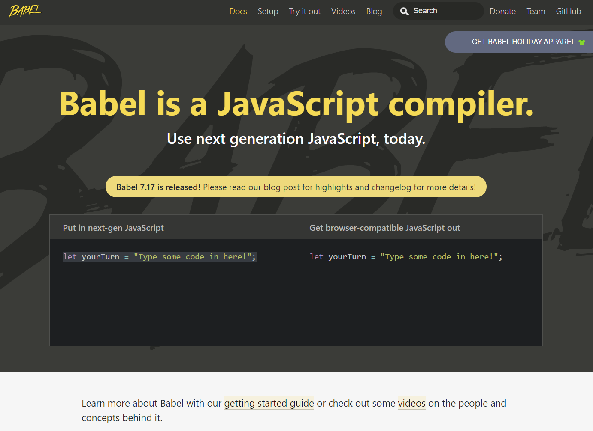

# <font color="red">Sección 1: Introducción</font>
## <font color="yellow">1. Introducción al curso</font>

## <font color="yellow">2. ¿Cómo funcionará el curso?</font>

## <font color="yellow">3. ¿Cómo hacer preguntas?</font>

## <font color="yellow">4. Instalaciones necesarias y recomendadas</font>
### **Instalaciones Necesarias**
- [Google Chrome](https://www.google.com/chrome/)
- [React Developer Tools](https://chrome.google.com/webstore/detail/react-developer-tools/fmkadmapgofadopljbjfkapdkoienihi?hl=es&authuser=1)
- [Redux Devtools](https://chrome.google.com/webstore/detail/redux-devtools/lmhkpmbekcpmknklioeibfkpmmfibljd?hl=es)
- [Visual Studio Code](https://code.visualstudio.com/)
- [Postman](https://www.postman.com/downloads/)
- [Mongo Compass](https://www.mongodb.com/try/download/compass)
- [Git](https://git-scm.com/)
- [Node](https://nodejs.org/es/)
### **Extensiones de VSCode**
- [Activitus Bar](https://marketplace.visualstudio.com/items?itemName=Gruntfuggly.activitusbar)
- **Configuración del Bracket Pair Colorizer 2**
    [Bracket Pair Colorizer 2](https://marketplace.visualstudio.com/items?itemName=CoenraadS.bracket-pair-colorizer-2)
    ```
    "bracket-pair-colorizer-2.colors": [
        "#fafafa",
        "#9F51B6",
        "#F7C244",
        "#F07850",
        "#9CDD29",
        "#C497D4"
    ],
    ```
- **Tema en VSCode:**
    - [Monokai Night](https://marketplace.visualstudio.com/items?itemName=fabiospampinato.vscode-monokai-night)
    - [Iconos](https://marketplace.visualstudio.com/items?itemName=PKief.material-icon-theme)
- **Instalaciones recomendadas sobre React**
    - [ES7 React/Redux](https://marketplace.visualstudio.com/items?itemName=dsznajder.es7-react-js-snippets)
    - [Simple React Snippets](https://marketplace.visualstudio.com/items?itemName=burkeholland.simple-react-snippets)
    - [Auto Close Tag](https://marketplace.visualstudio.com/items?itemName=formulahendry.auto-close-tag)

# <font color="red">Sección 2: Introducción a React y conceptos generales</font>
## <font color="yellow">5. Introducción a la sección</font>

## <font color="yellow">6. Temas puntuales de la sección</font>

**¿Qué aprenderemos en esta sección?**

- ¿Qué es React?
- Conceptos generales
- Babel
- JSX

Daremos nuestros primeros pasos y una pequeña aplicación que nos ayudará a perderle el miedo a React rápidamente

## <font color="yellow">7. ¿Qué es React?</font>

Librería JS para crear aplicaciones.

Declarativa.

Eficiente.

Predecible (todo fluye en una sola vía).

Componentes: piezas de código encapsuladas que pueden tener estado (permite dividir una aplicación muy grande).

Server-side con Node.

Aplicaciones móviles con React Native.

```jsx
// Aplicacion en React mas sencilla posible
// JSX = JS + XML

const divRoot = document.querySelector('#root'); // se hace referencia a un div con id="root"
ReactDOM.render( <h1>Hola Mundo</h1> , divRoot ); // inyecta un html dentro de la etiqueta referenciada

//cont h1Tag = <h1>Hola Mundo</h1>; // variable/contante que contiene la etiqueta
//ReactDOM.render( h1Tag, divRoot ); // llama a una funcion de React para mostrar la "algo" en el html

//const h1Tag = document.createElement('h1', null, `Hola, soy ${ nombre }`);
    // version similar al hola mundo escrito en JSX (en React se simplifica usando simples etiquetas)
```

## <font color="yellow">8. Primeros pasos en React</font>

Primera aplicación completa con React:

```html
<!DOCTYPE html>
<html lang="en">
<head>
    <meta charset="UTF-8">

    <!-- Cargat React -->
    <script crossorigin src="<https://unpkg.com/react@16/umd/react.production.min.js>"></script>
    <script crossorigin src="<https://unpkg.com/react-dom@16/umd/react-dom.production.min.js>"></script>
    <!-- Importacion de babel (permite convertir javascript moderno a javascript comprensible por el navegador) -->
    <script src="<https://unpkg.com/babel-standalone@6/babel.min.js>"></script>

    <meta http-equiv="X-UA-Compatible" content="IE=edge">
    <title>ReactApp</title>
</head>
<body>

    <div id="root"></div>

    <script type="text/babel">

        const divRoot = document.querySelector('#root');

        const nombre = 'Alberto';
        const h1Tag = <h1>Hola Mundo, soy { nombre }!</h1>;

        ReactDOM.render( h1Tag, divRoot );

    </script>
    
</body>
</html>
```

## <font color="yellow">9. Introducción a Babel</font>

Babel: permite usar las últimas innovaciones del ECMAScript en cualquier navegador aunque este no soporte aun estas mejoras (incompatibilidad).

- [https://babeljs.io/](https://babeljs.io/)

